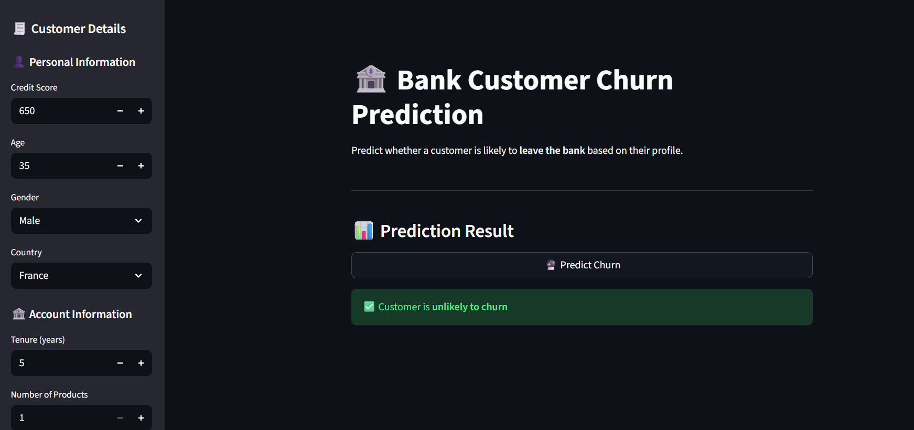
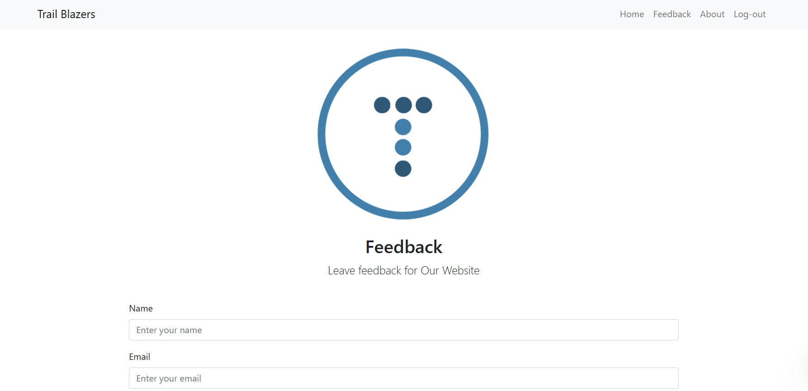
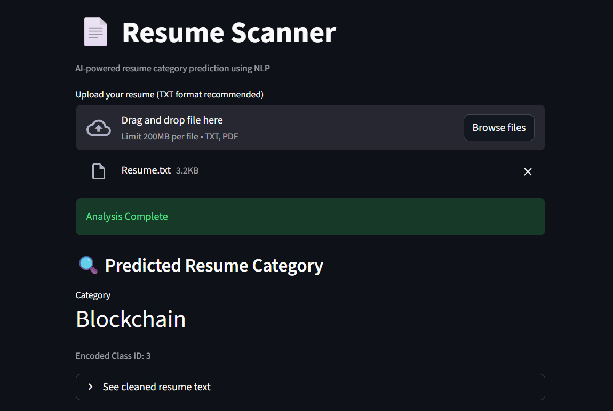
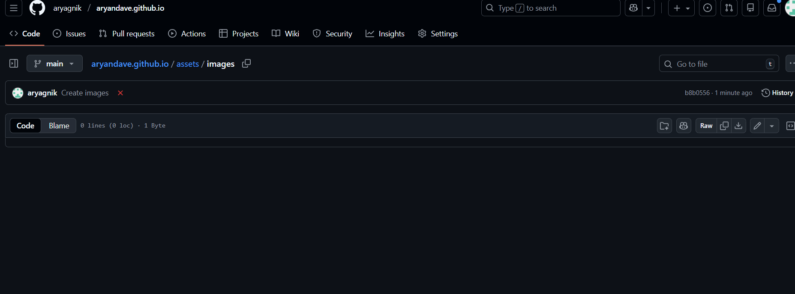

# Aryan Dave

📍 Ahmedabad, India  
📧 aryankavyam11@gmail.com  
📞 +91-8200300817  
🔗 [LinkedIn](https://linkedin.com/in/dave-aryan) | [GitHub](https://github.com/aryagnik)

---

## 🚀 About Me

I am a Computer Science undergraduate specializing in **Data Science**, with a strong foundation in **Machine Learning, Full-Stack Web Development, and Core Computer Science subjects**.  
I focus on building **practical, scalable, and data-driven solutions** rather than toy projects.

My interests lie at the intersection of **AI, real-world problem solving, and software engineering**, with a constant drive to improve system design, performance, and impact.

---

## 🎓 Education

**Vishwakarma Government Engineering College, Ahmedabad**  
Bachelor of Engineering – CSE (Data Science)  
**CGPA:** 9.16  
*Aug 2022 – Present*

**Silver Bells English Medium School, Palanpur**  
- HSC: **91.80%**  
- SSC: **94.60%**

---

## 🧠 Skills

### Programming Languages
- C, C++, Python, Java, SQL

### Web Development
- HTML, CSS, JavaScript  
- React, Node.js, Express.js

### Databases
- MySQL, MongoDB

### Machine Learning & Data Science
- Scikit-learn, Pandas, NumPy  
- Matplotlib, TensorFlow

### Core Computer Science
- Data Structures & Algorithms  
- Operating Systems  
- Computer Networks  
- DBMS  
- Computer Organization & Architecture  
- OOP Concepts

### Tools
- Git, VS Code, Postman

### Spoken Languages
- English, Hindi, Gujarati

---

## 📌 Projects

### 🔹 Bank Customer Churn Prediction Model  
**Tech Stack:** Python, Scikit-learn, Streamlit  
**Accuracy:** 93%

- Built a complete ML pipeline using a real-world Kaggle dataset.
- Performed **EDA**, **feature engineering**, and **outlier removal (Z-score)**.
- Applied **Ordinal Encoding**, **Standard Scaling**, and **class balancing (RandomOverSampler)**.
- Trained and evaluated multiple models:
  - Logistic Regression
  - SVM
  - Decision Tree
  - KNN
  - Random Forest
- Achieved best performance using a **Stacking Ensemble model**.
- Deployed an **interactive Streamlit web app** for real-time predictions.

  

---

### 🔹 Feedback Management System  
**Tech Stack:** HTML, CSS, JavaScript, PHP, MySQL

- Developed a full-stack web application for collecting and managing user feedback.
- Implemented **frontend validation** to ensure clean data input.
- Designed authentication features: **Login, Sign Up, Logout**.
- Built backend logic using PHP for secure data handling.
- Integrated MySQL for persistent storage and retrieval of feedback records.

---

### 🔹 Resume Scanner & Job Description Matching System
**Tech Stack:** Python, Scikit-learn, Streamlit, NLP  
**Accuracy:** 99.4%

- Developed an AI-based Resume Scanner using Python, Scikit-learn, NLTK, and Streamlit to automatically classify resumes into 25+ job domains.
- Implemented an NLP preprocessing pipeline including text cleaning, stopword removal, and lemmatization for robust feature extraction.
- Used TF-IDF vectorization and a Support Vector Classifier (SVC) for accurate resume category prediction.
- Designed a Resume–Job Description matching module using cosine similarity to calculate relevance scores.
- Built an interactive Streamlit web application to upload resumes, view predicted categories, and visualize match percentage.

## 🏆 Achievements

- **AIR 983 – GATE CS 2025** (Score: 722)
- **AIR 2177 – GATE DA 2025** (Score: 491)
- **Winner – Pitch-er Perfect 2025**
  - Startup pitch in **EdTech domain**
  - Focused on market awareness, scalability, and revenue potential

---
